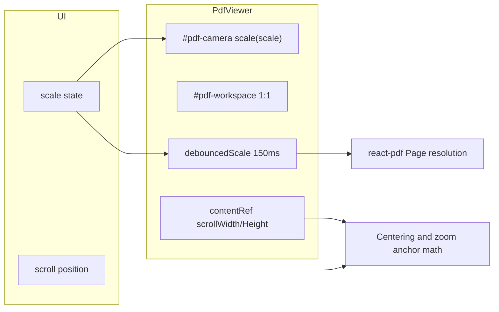

# CLAUDE.md

This file provides guidance to Claude Code (claude.ai/code) when working with code in this repository.

## Build & Development Commands

```bash
npm install              # Install dependencies
npm run dev              # Start Vite dev server (localhost:3000)
npm run build            # Production build to /dist
npm run preview          # Preview production build
npm run electron:dev     # Dev with Electron (desktop app)
npm run electron:build   # Package desktop app (NSIS installer)
```

Set `GEMINI_API_KEY` in `.env.local` for AI chat features.

## Project Overview

LuminaPDF is a high-performance web PDF reader built with React 19 + TypeScript + Vite. **Rendering** is done with react-pdf (PDF.js) at scale 1:1 in a fixed layout; zoom is purely visual via a single **CSS transform** applied to the whole scene (architecture "Caméra"). **Continuous scroll** shows all pages in a column; **virtualization** is handled by **LazyPage** + IntersectionObserver (rootMargin 2000px)—there is no tile engine. **Quality**: scale updates the layout in real time; **debouncedScale** (useDebounce 150ms) drives high-resolution PDF rendering for sharp output after the zoom stabilizes.

### Tech Stack
- React 19, TypeScript ~5.8, Vite 6
- PDF.js via react-pdf (standard worker, no custom tile worker)
- Tailwind CSS 3.4 (local + PostCSS), lucide-react icons
- Electron for desktop builds
- Google Gemini AI (`@google/genai`), Supabase (optional cloud features)

## Core Architecture: Camera + Geometry/Quality Decoupling

**GEOMETRY LAYER (instant, GPU)**
- `scale` and scroll position are applied via **transform: scale(scale)** on the **#pdf-camera** container, which wraps **#pdf-workspace**.
- The "world" (document + padding 100vh/100vw) has fixed 1:1 dimensions; zoom is purely visual (GPU).

**QUALITY LAYER (async, debounced ~150ms)**
- After geometry stabilizes, **debouncedScale** drives react-pdf page resolution (render width computed for HD injection).
- No tile layer and no discrete LOD—just react-pdf `<Page>` at the debounced scale.

See `.team_sync/TECH_ARCH.md` (Phase 2 Caméra) and `.team_sync/CODER_LOG.md` (Aiming Engine, centering, invariant formula) for details.

### Component Hierarchy

```
App.tsx (root state, drag-drop, scale, persistence)
├─ Toolbar.tsx
├─ PdfViewer.tsx (refs containerRef/contentRef, scale, debouncedScale, LazyPage)
│   ├─ #pdf-camera (transform: scale)
│   │   └─ #pdf-workspace (padding 100vh/100vw, layout grid)
│   │       └─ Document + LazyPage (IntersectionObserver, placeholder when outside 2000px)
│   │           └─ Page (react-pdf) + AnnotationLayer + ThemeFilterDefs (SVG feColorMatrix)
│   └─ OutlinePanel (outside camera so position: fixed works)
└─ AiPanel.tsx, RecentFiles.tsx, ReadingProgressBar, etc.
```

**OutlinePanel** must stay **outside** the container that has `transform` so that `position: fixed` works (Phase 3 decision in CODER_LOG).

Zoom/navigation flow:



### Key Utilities

| Module | Purpose |
|--------|---------|
| `ThemeManager.ts` | UI palettes + `getRenderPalette` for SVG feColorMatrix filter in PdfViewer |
| `useDebounce.ts` | Geometry → quality stabilization (debouncedScale) |

PDF.js worker is the standard one provided by react-pdf (GlobalWorkerOptions). Zoom state lives in App (`useState` scale); PdfViewer handles centering and scroll math. There is no `useZoom` hook, TileManager, RenderPool, or CoordinateSystem.

### Custom Hooks

| Hook | Purpose |
|------|---------|
| `useDebounce.ts` | Stabilizes scale for PDF render quality (150ms delay) |

## Critical Patterns (MUST MAINTAIN)

1. **Primitives in Dependencies**: Always use primitive values (`scale`, `x`, `y`) not objects in `useEffect`/`useMemo` dependencies. Objects cause infinite re-render loops.

2. **Zoom/Navigation Math**: The single source of truth for scroll/centering calculations is **contentRef** (the `scrollWidth`/`scrollHeight` of `#pdf-workspace`). **Never** use `container.scrollWidth` for ratios or centering—with `transform-origin: center` it is asymmetric and causes drift. See CODER_LOG "Maintenance Correction Géométrique Définitive (Aiming Engine)".

3. **Debounced Quality, Live Geometry**: Pan/scroll must be instant. Only PDF render quality uses debouncedScale.

4. **Virtualization**: Driven **only** by IntersectionObserver in LazyPage (rootMargin 2000px). Do not reintroduce "shouldCleanup" logic based on distance to currentPage (see `.team_sync/phases/phase4/PHASE4B_CONTINUOUS_SCROLL_FIX.md`).

5. **Theming**: Applied via **SVG feColorMatrix** filter (ThemeFilterDefs in PdfViewer) and CSS variables (ThemeManager). Do not use `filter: invert()`. There is no pixel recolorization in a worker (that architecture was removed).

6. **PDF.js Worker**: Use the standard worker via react-pdf (e.g. `pdfjs-dist/build/pdf.worker.min.mjs?url`); no custom tile worker.

## Coordinate System

- **World**: `#pdf-workspace` at 1:1 dimensions (document + padding).
- **Screen**: Viewport of the scroll container.
- **Zoom**: CSS `scale()` on `#pdf-camera`.

Centering and zoom-anchor math use **contentRef** (`content.scrollWidth`/`scrollHeight`) and the invariant projection (world center as pivot).

## Theming Architecture

9 themes (Light, Sepia, Dark, Midnight, Blue Night, Forest, Solarized, OLED, eInk) × 2 variants (Light/Dark) = 18 configurations.

PDF colorization: **feColorMatrix** (linear interpolation fg/bg) in the DOM via ThemeFilterDefs. UI uses CSS variables `--lumina-*` from ThemeManager. No worker → ImageBitmap pipeline.

## Worker Communication

PDF.js uses its standard worker (configured via react-pdf / GlobalWorkerOptions). There is no custom protocol (renderTile, cancelJob, ImageBitmap) in the current codebase.

## Project Status & Known Issues

**Context** (see `.team_sync/PROJECT_STATUS.md`): Project is a "Reconstruction (Rebirth)" started 2026-02-05. Phases 0–4 are **stable** (base display, continuous scroll + lazy, Camera architecture, annotations & outline, responsive & polish). **Phase 4B**: PWA/tablet optimizations (viewport dvh, manifest, continuous-scroll fix for 350+ pages)—implementation done; manual validation on Xiaomi Pad 6 pending.

**Known current issues**
- PWA tablet validation (Phase 4B) awaiting manual tests.
- Possible re-centering after rotation + manual zoom (workaround: Fit button).

**Backlog** (see `.team_sync/PROJECT_STATUS.md`): Thumbnail size optimization, multi-panel (AI + Outline on wide screens), cloud sync for annotations.
