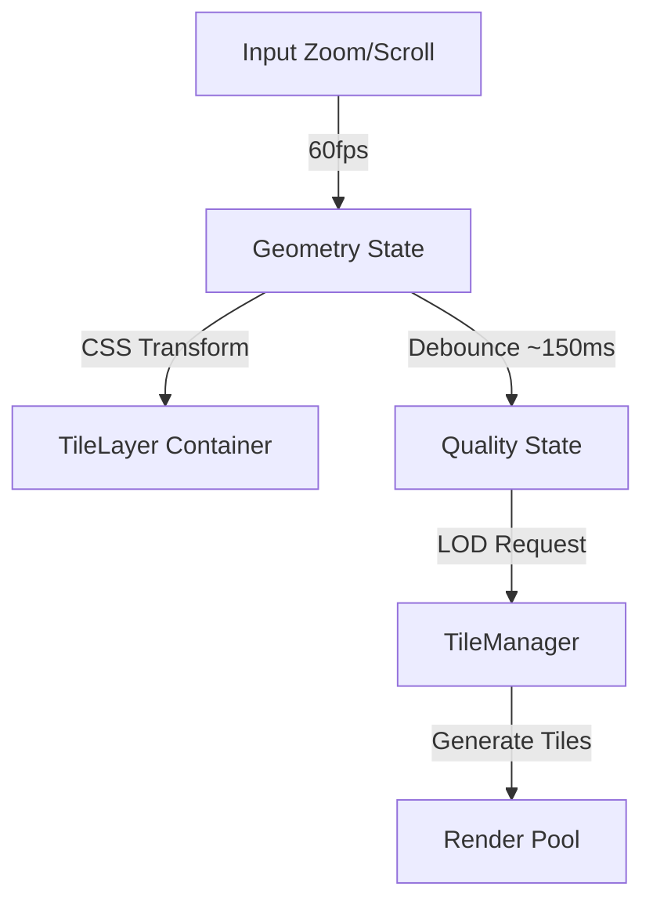

# ⚙️ LuminaPDF - Tiled Rendering Engine

## 🏗️ Philosophie & Architecture Hybride

LuminaPDF utilise une architecture de rendu **"Decoupled Geometry & Quality"**. 
Contrairement aux viewers classiques qui re-rendent le canvas à chaque frame de zoom, Lumina sépare la **position** (fluide) de la **résolution** (asynchrone).

### Schéma de Principe


1.  **Géométrie (Live)** : `scale`, `x`, `y` sont mis à jour instantanément. Le conteneur des tuiles est transformé via CSS `transform: matrix(...)`. Le rendu visuel est immédiat (mais peut être flou/pixellisé temporairement).
2.  **Qualité (Différée)** : Un `renderQualityScale` suit le `scale` réel avec un délai (Debounce). C'est lui qui déclenche le calcul lourd des nouvelles tuiles HD.

---

## 🚀 Pipeline de Rendu (Step-by-Step)

### 1. Calcul de Visibilité (`TileManager.ts`)
À chaque frame (si geometry change) ou après debounce (si quality change) :
- Le `TileManager` convertit le Viewport (écran) en World Coordinates.
- Il détermine le **LOD** (Level of Detail) approprié (ex: LOD 2.0 pour un zoom 200%).
- Il découpe la zone visible en une grille de tuiles (512px).
- **Tri Radial** : Les tuiles sont triées par distance au centre de l'écran. Celles du centre sont prioritaires.

### 2. Gestion des Tuiles (`TileLayer.tsx`)
- Compare les tuiles demandées avec celles déjà présentes.
- **Cache** : Utilise un `Map<TileId, boolean>` pour ne pas re-demander une tuile déjà montée.
- **Placeholders** : Si une tuile HD n'est pas prête, les tuiles basse résolution précédentes restent affichées (superposition) pour éviter le blanc.
- **OverviewLayer** : Une couche de fond permanente (LOD 0.25) garantit qu'il n'y a *jamais* de zone vide.

### 3. Ordonnancement (`RenderPool.ts`)
- Maintient un pool de N Workers (ex: 12 sur Ryzen AI 7).
- **Load Balancing** : Envoie le job au worker ayant la queue la plus courte.
- **Cancellation** : Si une tuile sort de l'écran avant d'être rendue, son job est annulé (`job.cancel()`) pour libérer les ressources.

### 4. Exécution Worker (`pdf.worker.ts`)
Le worker effectue trois opérations critiques :
1.  **PDF Render** : Appel à `page.render()` de PDF.js sur un `OffscreenCanvas`.
2.  **Luminance Map** : Analyse les pixels rendus.
3.  **Recolorisation** : Applique la palette du thème (ex: Sepia, Dark OLED) pixel par pixel.
    *   *Note* : Cela évite d'utiliser des filtres CSS `invert()` qui dégradent les images ou le contraste.
4.  **Transfert** : Renvoie un `ImageBitmap` (Zero-copy transfer) au thread principal.

---

## 📡 Protocole Worker

### Job Request
```typescript
interface RenderTileJob {
  tile: PDFTile;       // Coordonnées, LOD
  docId: string;       // URL/ID du PDF
  pageIndex: number;
  palette: ThemePalette; // Couleurs pour recolorisation
  dpr: number;         // Device Pixel Ratio (HiDPI)
}
```

### Optimisations Spécifiques
- **HiDPI Aware** : Le worker reçoit le DPR. Pour un écran Retina (DPR 2) et un Zoom 100%, il rend une tuile 1024x1024 (pour une surface CSS 512x512).
- **Grace Period** : Le cache des tuiles a une "grace period" (ex: 3s) avant suppression pour permettre un scroll aller-retour sans re-rendu.

---

## 📐 Système de Coordonnées (`CoordinateSystem.ts`)

Pour éviter les "gaps" (espaces blancs 1px) entre les tuiles :
- **Positions** : Toujours arrondies à l'entier inférieur (`Math.floor`).
- **Dimensions** : Toujours arrondies à l'entier supérieur (`Math.ceil`).
- **Overlap** : Les tuiles se chevauchent virtuellement d'un pixel pour garantir la continuité.

---

## 🛡️ Stabilité & Failles Connues

### Ce qui est blindé 💪
- **Bouclies infinies** : Les `useMemo` de `TileLayer` dépendent de primitives (`scale`, `x`, `y`) et non d'objets, empêchant les re-renders cycliques.
- **Memoire** : Cache LRU (Least Recently Used) strict sur les pages PDF dans le worker.

### Ce qui est surveillé ⚠️
- **Crash Zoom** : Un zoom violent (> 5 click/sec) peut surcharger la queue (corrigé par ErrorBoundary + Throttle).
- **Tuiles Floues** : Rarement, une tuile HD ne remplace pas sa version SD (race condition cache).
